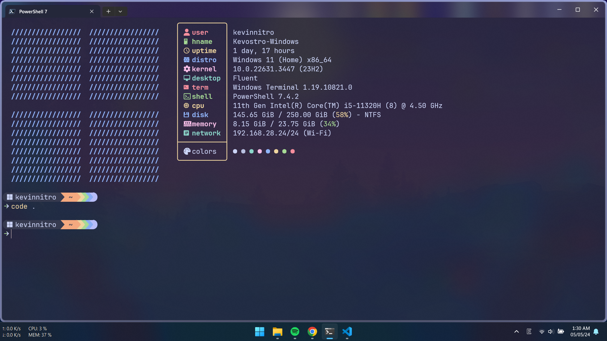
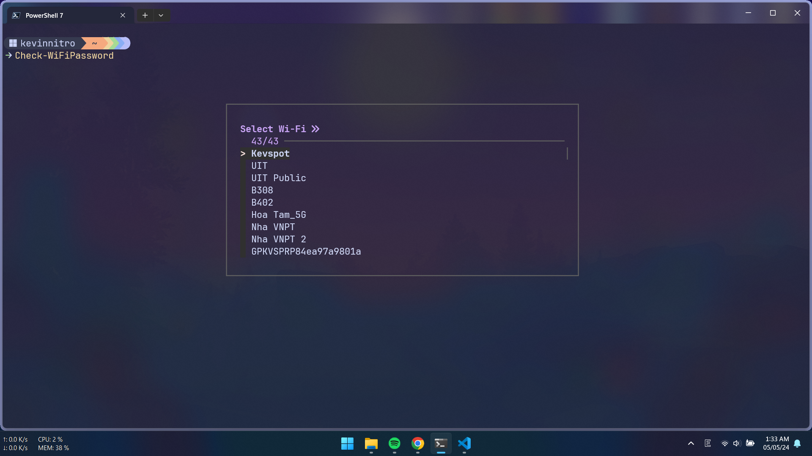
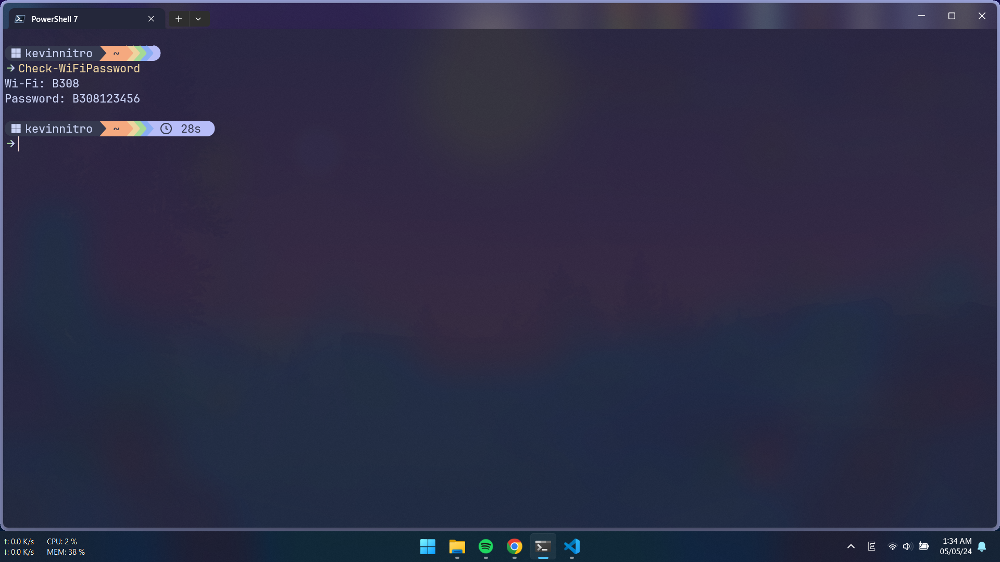
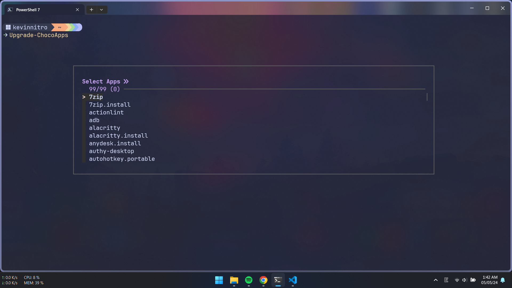
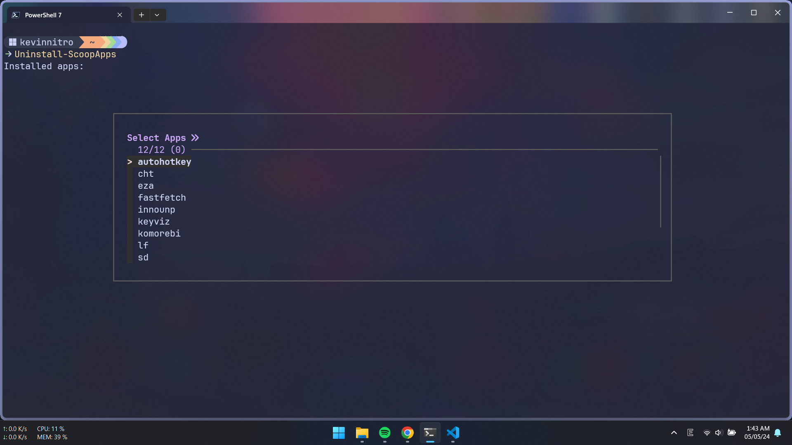
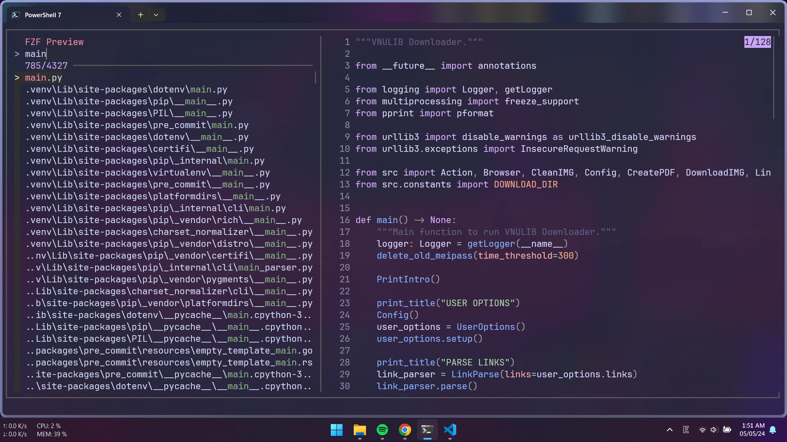
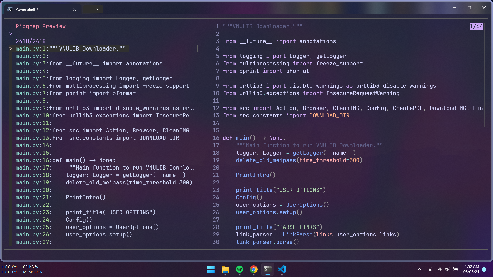
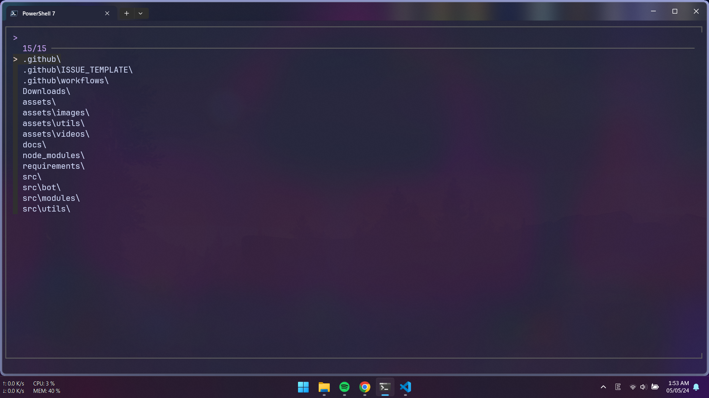
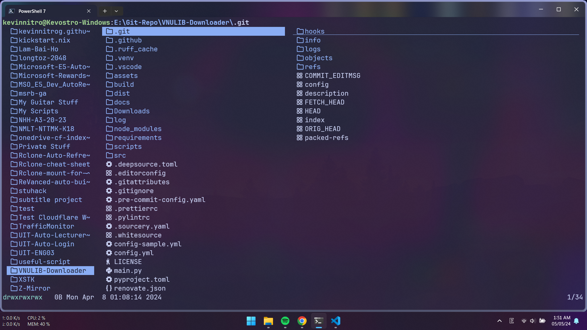

# KEVINNITRO WINDOWS DOTFILES

[](../../commits/main)


---

## Table of Contents

- [KEVINNITRO WINDOWS DOTFILES](#kevinnitro-windows-dotfiles)
  - [Table of Contents](#table-of-contents)
  - [😎 PREVIEW](#-preview)
    - [Terminal](#terminal)
    - [Check Wifi Password](#check-wifi-password)
    - [App Manage](#app-manage)
    - [Change directory schemes](#change-directory-schemes)
  - [🪴 USE](#-use)
    - [1️⃣ Add SSH](#1️⃣-add-ssh)
    - [2️⃣ Install prerequisite](#2️⃣-install-prerequisite)
    - [3️⃣ Chezmoi](#3️⃣-chezmoi)
    - [4️⃣ Set env path _(Admin)_](#4️⃣-set-env-path-admin)
    - [5️⃣ Install softwares](#5️⃣-install-softwares)
    - [6️⃣ Install fonts](#6️⃣-install-fonts)
    - [7️⃣ Install some code stuff](#7️⃣-install-some-code-stuff)
  - [🎈 EXTRAS](#-extras)
    - [Crack Winrar _(Admin)_](#crack-winrar-admin)
    - [Patch IDM](#patch-idm)
    - [Install \& Active Office](#install--active-office)
    - [Spotify](#spotify)
    - [Need to do](#need-to-do)
    - [Others](#others)
  - [📒 NOTES](#-notes)
    - [SSH](#ssh)
    - [GPG](#gpg)
    - [Windows](#windows)
      - [View current path](#view-current-path)
      - [Variables](#variables)
      - [Others](#others-1)

## 😎 PREVIEW

### Terminal



### Check Wifi Password

|                            **SELECT**                             |                             **SHOWN**                             |
| :---------------------------------------------------------------: | :---------------------------------------------------------------: |
|  |  |

> [!NOTE]
> Using FZF if installed. Worked even without FZF but I'm lazy to show.

### App Manage

|  **PM**   |                         **UPGRADE**                          |                          **UNINSTALL**                           |
| :-------: | :----------------------------------------------------------: | :--------------------------------------------------------------: |
| **CHOCO** |  |  |
| **SCOOP** |  |  |

> [!NOTE]
>
> Mange via Package Managers

> [!IMPORTANT]
>
> Need FZF

### Change directory schemes

|                                         |                                                   |
| :-------------------------------------: | :-----------------------------------------------: |
|     |                 |
| [fzf](https://github.com/junegunn/fzf/) | [ripgrep](https://github.com/BurntSushi/ripgrep/) |
|       |                 |
|  [fd](https://github.com/sharkdp/fd/)   |       [lf](https://github.com/gokcehan/lf/)       |

## 🪴 USE

### 1️⃣ Add SSH

- SSH _(Admin)_

```ps1
Set-Service ssh-agent -StartupType Automatic
Start-Service ssh-agent
ssh-add "$env:USERPROFILE/.ssh/id_rsa"
```

- Import GPG Keys:

```ps1
# Public key
gpg --import public.gpg
gpg --import secret.gpg
```

> In order to encrypt / decrypt chezmoi

### 2️⃣ Install prerequisite

- Set execution policy to run script from URL _(Admin)_

```ps1
Set-ExecutionPolicy -ExecutionPolicy Unrestricted -Scope CurrentUser
```

- Install prequisite scoop _(non-admin)_

```ps1
iwr "https://raw.githubusercontent.com/KevinNitroG/windows-dotfiles/main/dot_install/prerequisiteScoop.ps1" | iex
```

- Install prequisite choco _(admin)_

```ps1
iwr "https://raw.githubusercontent.com/KevinNitroG/windows-dotfiles/main/dot_install/prerequisiteChoco.ps1" | iex
```

### 3️⃣ Chezmoi

> [!IMPORTANT]
>
> Use powershell IDE, don't use Windows Terminal.
>
> Run with Administrator

```ps1
chezmoi init --apply --verbose git@github.com:KevinNitroG/windows-dotfiles.git
```

> Follow instruction of chezmoi to setup chezmoi config

### 4️⃣ Set env path _(Admin)_

```ps1
iwr "https://raw.githubusercontent.com/KevinNitroG/windows-dotfiles/main/dot_install/environmentVariables.ps1" | iex
```

### 5️⃣ Install softwares

- Install programming languages

```ps1
iwr "https://raw.githubusercontent.com/KevinNitroG/windows-dotfiles/main/dot_install/programmingLanguage.ps1" | iex
```

- Install softwares _(non-admin)_

```ps1
iwr "https://raw.githubusercontent.com/KevinNitroG/windows-dotfiles/main/dot_install/softwares-nonadmin.ps1" | iex
```

- Install softwares _(admin)_

```ps1
iwr "https://raw.githubusercontent.com/KevinNitroG/windows-dotfiles/main/dot_install/softwares-nadmin.ps1" | iex
```

### 6️⃣ Install fonts

- https://fonts.google.com/specimen/Be+Vietnam+Pro?query=be+vie

### 7️⃣ Install some code stuff

```ps1
# ruff
pip intsall ruff

# cpplint
pip install cpplint

# prettier
npm install prettier

# eslint
npm install eslint

# markdownlint
npm install markdownlint
```

## 🎈 EXTRAS

### Crack Winrar _(Admin)_

```ps1
curl https://gist.githubusercontent.com/MuhammadSaim/de84d1ca59952cf1efaa8c061aab81a1/raw/rarreg.key | Out-File -FilePath "C:\Program Files\WinRAR\rarreg.key" -Force
```

> [Source](https://gist.github.com/MuhammadSaim/de84d1ca59952cf1efaa8c061aab81a1)

### Patch IDM

- Patch script

```ps1
iex(irm is.gd/idm_reset)
```

- Block host

```ps1
$file = "C:\Windows\System32\drivers\etc\hosts"
$hostfile =Get-Content $file
$hostfile += "127.0.0.1     internetdownloadmanager.com"
$hostfile += "127.0.0.1     registeridm.com"
Set-Content -Path $file -Value $hostfile -Force
```

### Install & Active Office

- Install: [OTP Ladian](https://otp.landian.vip/redirect/download.php?type=runtime&arch=x64&site=github)

- Active

```ps1
irm https://massgrave.dev/get | iex
```

### Spotify

- SpotX

```ps1
# main
iex "& { $(iwr -useb 'https://raw.githubusercontent.com/SpotX-Official/spotx-official.github.io/main/run.ps1') } -new_theme"
# mirror
iex "& { $(iwr -useb 'https://spotx-official.github.io/run.ps1') } -m -new_theme"
```

### Need to do

- Change ownership of old folders / files
- Install Cursor
- Change `Downloads`, `Desktop`,... location
- Restore Powertoys settings
- Winaero-tweaker
  - Disable Windows Defender
  - Disable Shortcut Arrow
- [VisualCppRedist AIO](https://github.com/abbodi1406/vcredist/releases/latest/download/VisualCppRedist_AIO_x86_x64.exe)
- EVKey / Unikey
- Wakatime CLI _(Required by Terminal Powershell)_: `pip install wakatime`
- Wakatime for Office
  - [Word](https://github.com/wakatime/office-wakatime/releases/download/latest/WordSetup.zip)
  - [PowerPoint](https://github.com/wakatime/office-wakatime/releases/download/latest/PowerPointSetup.zip)
  - [Excel](https://github.com/wakatime/office-wakatime/releases/download/latest/ExcelSetup.zip)
- Chrome flags
- MathType
- Spotify
  ```ps1
  v $env:USERPROFILE\AppData\Roaming\Spotify\prefs
  ```
  ```diff
  +storage.size=500
  ```
- Windows Settings
  - Wallpaper: https://github.com/DenverCoder1/minimalistic-wallpaper-collection
  - Touchpad Gestures _(3 & 4 fingers)_
  - DNS from NextDNS _(https://router.nextdns.io/?limit=50&stack=dual)_:
  - IPv4
    - `103.186.65.82`
    - `https://greencloud-sgn-1.edge.nextdns.io/`
    - `38.60.253.211`
    - `https://lightnode-sgn-1.edge.nextdns.io/`
  - IPv6
    - `2400:6ea0:0:1236::d6e2`
    - `https://greencloud-sgn-1.edge.nextdns.io/`
    - `2606:4700:4700::1111`
    - `https://cloudflare-dns.com/dns-query`
  - Power & Sleep
  - Print Screen button with snipping tool

### Others

- [Keyviz](https://github.com/mulaRahul/keyviz/releases/latest)
- [Optimizer](https://github.com/hellzerg/optimizer/releases/latest)
- [iSlide](https://islide-powerpoint.com/en/downloads-en)
- [3UTools](https://www.3u.com/)
- [qBittorrent _(qt6)_](https://github.com/c0re100/qBittorrent-Enhanced-Edition/releases/latest)
- [OBS Background Removal](https://github.com/occ-ai/obs-backgroundremoval/releases/latest)
- Keystore Explorer
- Minecraft: [Legacy Launcher](https://llaun.ch/en)
- Microsoft Teams
- [MPC - HC](https://github.com/clsid2/mpc-hc)
- ViveTool
  ```.ps1
  vivetool /disable /id:42354458 # Disable desktop switch animation
  ```

## 📒 NOTES

> Just something for me that I often forget

### SSH

Public key

```id_rsa.pub
ssh-rsa AAAAB3NzaC1yc2EAAAADAQABAAABgQDap/5GnLxYYNJ2QB1rYRgXyHLQud0L3Y6sfiPL6iAdqZRm+f+006DeZtJ4oP2IN8oS6nF6tfWhCaQ91jv3fZWO+olhyBZulSGbb75WdcqLcctfDwc9er+BZZZMBsF0inEbCgHEooo5kelkuuPIEUmeqn9ozUtQ4A6mLIurjsGfy2nD2bCjYys3UxUa09xEiQxvgHnlvSPCh9XvG1h4eX611GI6EbtJoOvzFPYzaxdNosbombq1HMnNGXk3TMS9fghE1GjnMiBbrortGn6mT0aNi//N9Wgr9AYR0dY2BWk1CZXF78G4MWZoaLOLW5sriMjU881UbfmJx6MmvMAEHDrfJDIQAIoRsjAJbw00SoZjspEg3R8f8ekNjduzikG65noMJGd+jTD7MtBDe+YNCuZp6UQAPwbPQLtlbKOysEWzPupKMHIsPkzUJpdYp1ML1ljV/q+FLRKje4FvWUKTk8KekWxp2tUyn5gWUIrG7DGkE5MKpBp0njFJ17n8H81xQJs= trannguyenthaibinh46@gmail.com
```

### GPG

- Export keys

```.ps1
# Public key
gpg --output kevinnitro-public-gpg-key.pgp --armor --export trannguyenthaibinh46@gmail.com

# Secret key
gpg --output kevinnitro-secret-gpg-key.pgp --armor --export-secret-key trannguyenthaibinh46@gmail.com
```

> Remove `ouput` params to export out stdout
>
> Ref: https://unix.stackexchange.com/a/482559

- Import _(for both public and secret keys)_

```.ps1
gpg --import the-key.gpg
```

### Windows

#### View current path

- System path

```ps1
[System.Environment]::GetEnvironmentVariable("Path", [System.EnvironmentVariableTarget]::Machine)
```

- User path

```ps1
[System.Environment]::GetEnvironmentVariable("Path", [System.EnvironmentVariableTarget]::User)
```

#### Variables

| **VARIABLE**        | **PATH**                                 |
| ------------------- | ---------------------------------------- |
| `APPDATA`           | `C:\Users\kevinnitro\AppData\Roaming`    |
| `HOMEDRIVE`         | `C:`                                     |
| `USERPROFILE`       | `C:\Users\kevinnitro`                    |
| `HOMEPATH`          | `\Users\kevinnitro`                      |
| `LOCALAPPDATA`      | `C:\Users\kevinnitro\AppData\Local`      |
| `PROGRAMDATA`       | `C:\ProgramData`                         |
| `PROGRAMFILES`      | `C:\Program Files`                       |
| `PROGRAMFILES(X86)` | `C:\Program Files (x86)`                 |
| `SYSTEMROOT`        | `C:\Windows`                             |
| `TEMP` & `TMP`      | `C:\Users\kevinnitro\AppData\Local\Temp` |
| `USERDOMAIN`        | `DESKTOP-7QJ8Q7V`                        |
| `USERNAME`          | `kevinnitro`                             |
| `WINDIR`            | `C:\Windows`                             |

> [Source](https://learn.microsoft.com/en-us/windows/deployment/usmt/usmt-recognized-environment-variables)
>
> More reference: [Complete List of Environment Variables in Windows 10](https://gist.github.com/RebeccaWhit3/5dad8627b8227142e1bea432db3f8824)

#### Others

- Program shortcut: `%USERPROFILE%\AppData\Roaming\Microsoft\Windows\Start Menu\Programs`
- [Datetime format](https://help.scribesoft.com/scribe/en/sol/general/datetime.htm)
- [CLSID Key (GUID) Shortcuts List for Windows 10](https://www.tenforums.com/tutorials/3123-clsid-key-guid-shortcuts-list-windows-10-a.html)
- [Shell Commands List for Windows 10](https://www.tenforums.com/tutorials/3109-shell-commands-list-windows-10-a.html)
- [Rundll32 Commands List for Windows 10](https://www.tenforums.com/tutorials/77458-rundll32-commands-list-windows-10-a.html)
