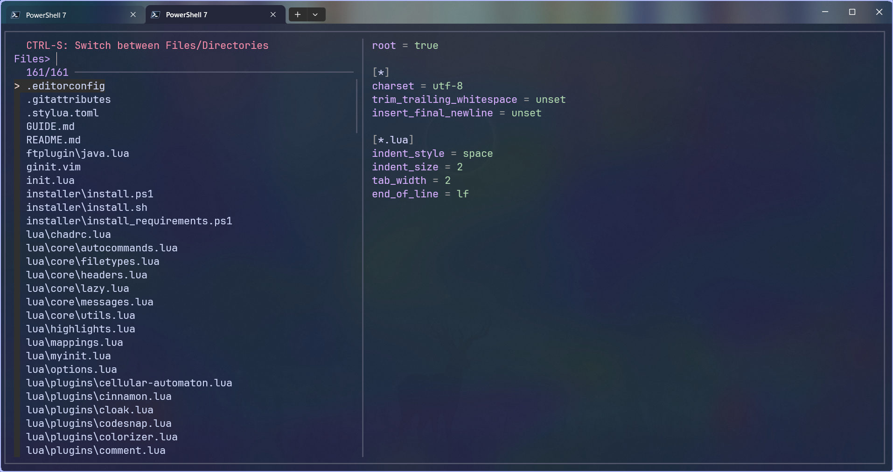
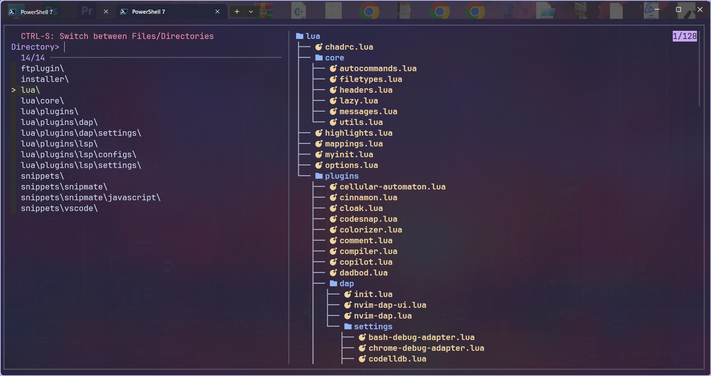
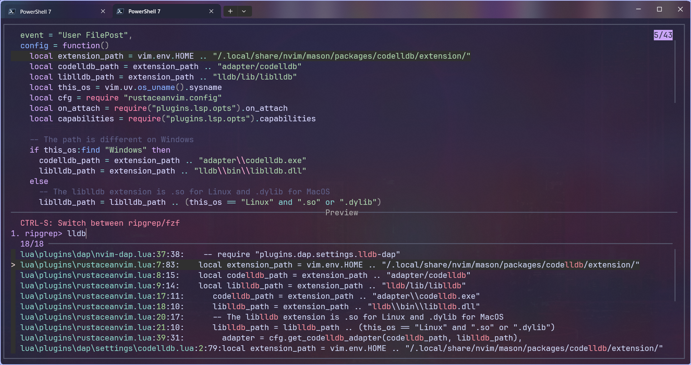
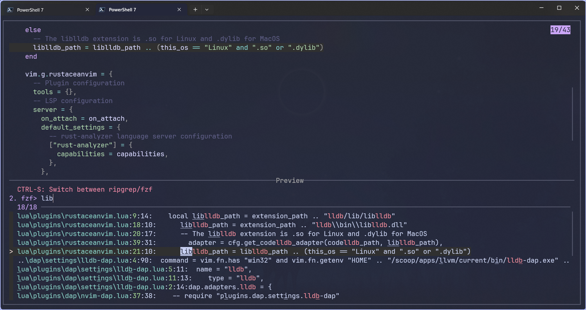
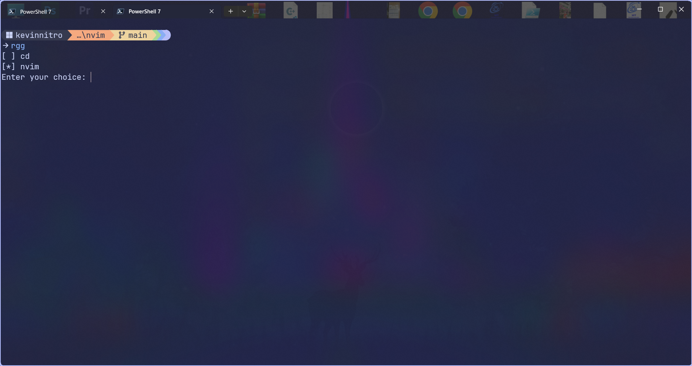
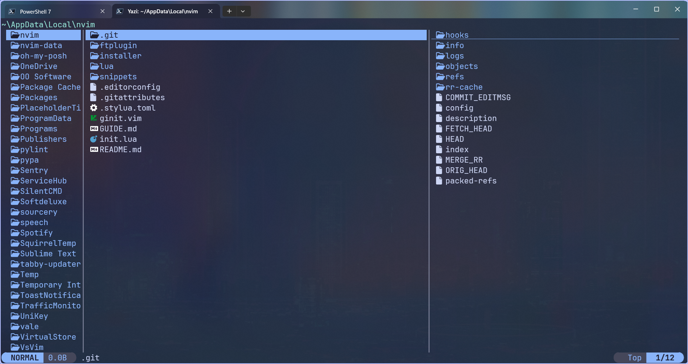
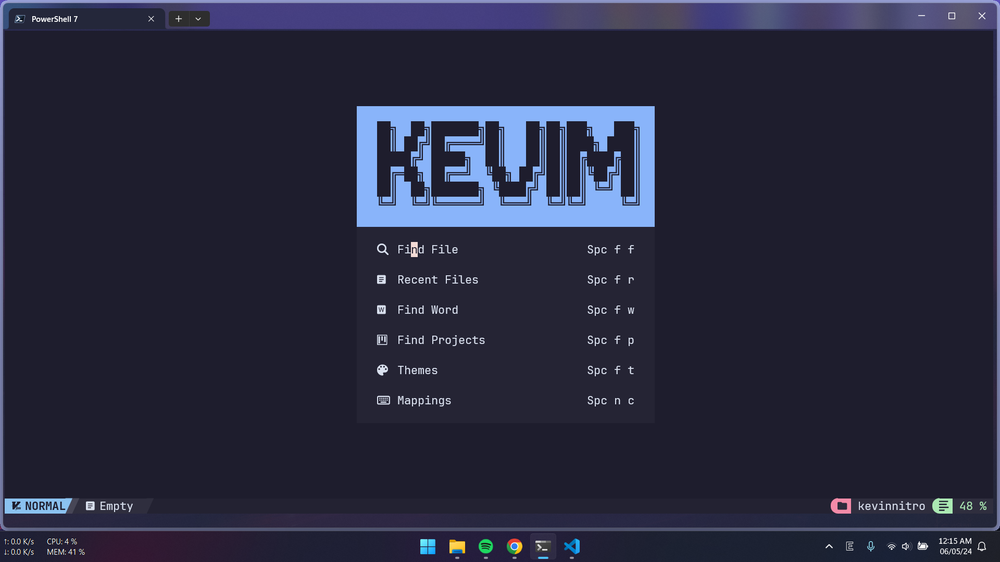

# KEVINNITRO WINDOWS DOTFILES

[](../../commits/main)


> [!IMPORTANT]
>
> Please just use this as reference. My installation may not work _(because I haven't tested yet)_. Just go and grab the config you like.

---

- [KEVINNITRO WINDOWS DOTFILES](#kevinnitro-windows-dotfiles)
  - [😎 PREVIEW](#-preview)
    - [Terminal](#terminal)
    - [Check Wifi Password](#check-wifi-password)
    - [App Manage](#app-manage)
    - [Find files / directories / file content](#find-files--directories--file-content)
    - [Neovim](#neovim)
  - [🪴 INSTALL](#-install)
    - [1️⃣ Add Keys](#1️⃣-add-keys)
    - [2️⃣ Install prerequisite](#2️⃣-install-prerequisite)
    - [3️⃣ Chezmoi](#3️⃣-chezmoi)
    - [4️⃣ Set env path _(Admin)_](#4️⃣-set-env-path-admin)
    - [5️⃣ Install softwares](#5️⃣-install-softwares)
    - [6️⃣ Install fonts](#6️⃣-install-fonts)
    - [7️⃣ Install some code stuff via `Mason` manually](#7️⃣-install-some-code-stuff-via-mason-manually)
      - [DAP](#dap)
      - [Linter](#linter)
      - [Formatter](#formatter)
    - [🧪 ONE SCRIPT _(test)_](#-one-script-test)
  - [🎈 EXTRAS](#-extras)
    - [Crack Winrar _(Admin)_](#crack-winrar-admin)
    - [Patch IDM](#patch-idm)
      - [Repack.me](#repackme)
      - [PITVN](#pitvn)
      - [Old method](#old-method)
    - [Install \& Active Office](#install--active-office)
    - [Spotify](#spotify)
    - [Chrome extensions](#chrome-extensions)
    - [Need to do](#need-to-do)
    - [Others](#others)
  - [📒 NOTES](#-notes)
    - [SSH](#ssh)
    - [GPG](#gpg)
    - [Windows](#windows)
      - [Set / Get variables](#set--get-variables)
      - [Default variables](#default-variables)
      - [Others](#others-1)

---

## 😎 PREVIEW

### Terminal


### Check Wifi Password

|                            **SELECT**                             |                             **SHOWN**                             |
| :---------------------------------------------------------------: | :---------------------------------------------------------------: |
|  |  |

> [!NOTE]
> Using FZF if installed. Work even without FZF but I'm lazy to show.

---

### App Manage

|  **PM**   |                         **UPGRADE**                          |                          **UNINSTALL**                           |
| :-------: | :----------------------------------------------------------: | :--------------------------------------------------------------: |
| **SCOOP** |  |  |
| **CHOCO** |  |  |

> [!NOTE]
>
> Mange via Package Managers **(Scoop isn't PM btw :v)**

> [!IMPORTANT]
>
> Need FZF

---

### Find files / directories / file content

|     [fzf](https://github.com/junegunn/fzf/)      |             [fd](https://github.com/sharkdp/fd/)              |
| :----------------------------------------------: | :-----------------------------------------------------------: |
|  |  |

| [ripgrep](https://github.com/BurntSushi/ripgrep) |          [fzf](https://github.com/junegunn/fzf/)           |
| :----------------------------------------------: | :--------------------------------------------------------: |
|  |  |



> [!NOTE]
>
> These come from [fzf advanced integration](https://github.com/junegunn/fzf/blob/master/ADVANCED.md) but in Powershell
>
> The config is in [Documents/PowerShell/Scripts/kevinnitro/fzf.ps1](https://github.com/KevinNitroG/windows-dotfiles/blob/main/Documents/PowerShell/Scripts/kevinnitro/fzf.ps1)

- Bonus: [yazi](https://github.com/sxyazi/yazi) and cd
  

---

### Neovim



> [!NOTE]
>
> I use [Alexis12119's nvim config](https://github.com/Alexis12119/nvim-config)
>
> My [fork config](https://github.com/KevinNitroG/Alexis12119-nvim)

---

## 🪴 INSTALL

### 1️⃣ Add Keys

- SSH _(Admin)_
  ```ps1
  Set-Service ssh-agent -StartupType Automatic
  Start-Service ssh-agent
  ssh-add "$env:USERPROFILE/.ssh/id_ed25519"
  ```
- Import GPG Keys _(use builtin GPG from git)_:
  ```sh
  git bash
  gpg --import public.gpg
  gpg --import secret.gpg
  gpg --edit-key KevinNitroG
  trust
  5
  y
  quit
  ```

> In order to encrypt / decrypt chezmoi

---

### 2️⃣ Install prerequisite

- Set execution policy to run script from URL _(non-admin)_
  ```ps1
  Set-ExecutionPolicy -ExecutionPolicy Unrestricted -Scope CurrentUser
  ```
- Install prequisite scoop _(non-admin)_
  ```ps1
  iwr "https://raw.githubusercontent.com/KevinNitroG/windows-dotfiles/main/dot_install/prerequisiteScoop.ps1" | iex
  ```
- Install prequisite choco _(admin)_
  ```ps1
  iwr "https://raw.githubusercontent.com/KevinNitroG/windows-dotfiles/main/dot_install/prerequisiteChoco.ps1" | iex
  ```

---

### 3️⃣ Chezmoi

> [!IMPORTANT]
>
> Use powershell IDE _(not pwsh also)_, don't use Windows Terminal.
>
> Run with Administrator

```ps1
chezmoi init --apply --verbose git@github.com:KevinNitroG/windows-dotfiles.git
```

> Follow instruction of chezmoi to setup chezmoi config

---

### 4️⃣ Set env path _(Admin)_

```ps1
iwr "https://raw.githubusercontent.com/KevinNitroG/windows-dotfiles/main/dot_install/environmentVariables.ps1" | iex
```

---

### 5️⃣ Install softwares

- Install programming languages
  ```ps1
  iwr "https://raw.githubusercontent.com/KevinNitroG/windows-dotfiles/main/dot_install/programmingLanguage.ps1" | iex
  ```
- Install softwares _(non-admin)_
  ```ps1
  iwr "https://raw.githubusercontent.com/KevinNitroG/windows-dotfiles/main/dot_install/softwares-nonadmin.ps1" | iex
  ```
- Install softwares _(admin)_
  ```ps1
  iwr "https://raw.githubusercontent.com/KevinNitroG/windows-dotfiles/main/dot_install/softwares-admin.ps1" | iex
  ```

---

### 6️⃣ Install fonts

- https://fonts.google.com/specimen/Be+Vietnam+Pro?query=be+vie

---

### 7️⃣ Install some code stuff via `Mason` manually

#### DAP

- js-debug-adapter
- codelldb / cpptools
- debugpy

#### Linter

- ruff
- actionlint
- cpplint
- markdownlint

#### Formatter

- ruff
- markdownlint
- prettier
- stylua

---

### 🧪 ONE SCRIPT _(test)_

> [!NOTE]
>
> This script merges above steps. But haven't been tested yet.
> Go import SSH and GPG keys first.
>
> It may not work =))

- Set execution policy to run script from URL _(non-admin)_
  ```ps1
  Set-ExecutionPolicy -ExecutionPolicy Unrestricted -Scope CurrentUser
  ```
- Run script _(non-admin)_
  ```ps1
  iwr "https://raw.githubusercontent.com/KevinNitroG/windows-dotfiles/main/dot_install/install.ps1" | iex
  ```

---

## 🎈 EXTRAS

### Crack Winrar _(Admin)_

```ps1
curl https://gist.githubusercontent.com/MuhammadSaim/de84d1ca59952cf1efaa8c061aab81a1/raw/rarreg.key | Out-File -FilePath "C:\Program Files\WinRAR\rarreg.key" -Force
```

> [Source](https://gist.github.com/MuhammadSaim/de84d1ca59952cf1efaa8c061aab81a1)

---

### Patch IDM

#### Repack.me

- Close source tool from [repack.me by Alexey1980](https://repack.me/software/repacks/internet/15-idm.html)
- [Download tool](https://workupload.com/file/gJuZfPnJhQK)

> [!NOTE]
>
> Password is inside the archived file

#### PITVN

- [PITVN](https://docs.google.com/document/d/19MCt6uXlJYJO71L35Tj_PcGvWhL_W-SoYYkcnVA07fU/edit?usp=sharing)

#### Old method

- Patch script
  ```ps1
  iex(irm is.gd/idm_reset)
  ```
- Disable check for update
  - `HKEY_CURRENT_USER\Software\DownloadManager`
  - `CheckUpdtVm`: `10` ->`0`
- Block host **(admin)**
  ```ps1
  v "C:\Windows\System32\drivers\etc\hosts"
  ```
  ```diff
  +  127.0.0.1           tonec.com
  +  127.0.0.1           www.tonec.com
  +  127.0.0.1           registeridm.com
  +  127.0.0.1           www.registeridm.com
  +  127.0.0.1           secure.registeridm.com
  +  127.0.0.1           internetdownloadmanager.com
  +  127.0.0.1           www.internetdownloadmanager.com
  +  127.0.0.1           secure.internetdownloadmanager.com
  +  127.0.0.1           mirror.internetdownloadmanager.com
  +  127.0.0.1           mirror2.internetdownloadmanager.com
  +  127.0.0.1           mirror3.internetdownloadmanager.com
  ```

---

### Install & Active Office

- Install: [OTP Ladian](https://otp.landian.vip/redirect/download.php?type=runtime&arch=x64&site=github)

- Active
  ```ps1
  irm https://massgrave.dev/get | iex
  ```

---

### Spotify

- SpotX
  ```ps1
  # main
  iex "& { $(iwr -useb 'https://raw.githubusercontent.com/SpotX-Official/spotx-official.github.io/main/run.ps1') } -new_theme"
  # mirror
  iex "& { $(iwr -useb 'https://spotx-official.github.io/run.ps1') } -m -new_theme"
  ```

---

### Chrome extensions

- [AltNumberTab](https://github.com/pointtonull/AltNumberTab/tree/master)
- [bypass paywalls chrome](https://github.com/iamadamdev/bypass-paywalls-chrome)
- [useful-script](https://github.com/HoangTran0410/useful-script)

> [!NOTE]
>
> Those are extensions which aren't in webstore and have to be installed manually.

---

### Need to do

- Change ownership of old folders / files
- Install Cursor
  - [Vision Cursor](https://www.deviantart.com/idarques/art/Vision-Cursor-911891424)
  - [Windows 11 Cursor Rosea92](https://github.com/YT-Advanced/Windows-11-Cursor-by-rosea92)
- Change `Downloads`, `Desktop`,... location
- Symlink `git folder` _(admin)_
  ```ps1
  New-Item -Path gits -ItemType SymbolicLink -Value E:\Git-Repo
  ```
- Restore Powertoys settings
- Winaero-tweaker
  - Disable Windows Defender
  - Disable Shortcut Arrow
- [VisualCppRedist AIO](https://github.com/abbodi1406/vcredist/releases/latest/download/VisualCppRedist_AIO_x86_x64.exe)
- EVKey / Unikey
- Wakatime CLI _(Required by Terminal Powershell)_: `pip install wakatime`
- Wakatime for Office
  - [Word](https://github.com/wakatime/office-wakatime/releases/download/latest/WordSetup.zip)
  - [PowerPoint](https://github.com/wakatime/office-wakatime/releases/download/latest/PowerPointSetup.zip)
  - [Excel](https://github.com/wakatime/office-wakatime/releases/download/latest/ExcelSetup.zip)
- Chrome flags
- MathType
- Spotify
  ```ps1
  v $env:USERPROFILE\AppData\Roaming\Spotify\prefs
  ```
  ```diff
  +storage.size=500
  ```
- Windows Settings
  - Wallpaper: https://github.com/DenverCoder1/minimalistic-wallpaper-collection
  - Touchpad Gestures _(3 & 4 fingers)_
  - DNS from NextDNS _(https://router.nextdns.io/?limit=50&stack=dual)_:
  - IPv4
    - `103.186.65.82`
    - `https://greencloud-sgn-1.edge.nextdns.io/`
    - `38.60.253.211`
    - `https://lightnode-sgn-1.edge.nextdns.io/`
  - IPv6
    - `2400:6ea0:0:1236::d6e2`
    - `https://greencloud-sgn-1.edge.nextdns.io/`
    - `2606:4700:4700::1111`
    - `https://cloudflare-dns.com/dns-query`
  - Power & Sleep
  - Print Screen button with snipping tool
- Make Windows to use UTC time in order to dual boot with Linux
  ```.ps1
  reg add "HKEY_LOCAL_MACHINE\System\CurrentControlSet\Control\TimeZoneInformation" /v RealTimeIsUniversal /d 1 /t REG_DWORD /f
  ```

---

### Others

- [Keyviz](https://github.com/mulaRahul/keyviz/releases/latest) _(Already install from PM)_
- [Optimizer](https://github.com/hellzerg/optimizer/releases/latest)
- [Winutil](https://github.com/ChrisTitusTech/winutil)
  ```ps1
  irm https://christitus.com/win | iex
  ```
- [iSlide](https://islide-powerpoint.com/en/downloads-en)
- [3UTools](https://www.3u.com/)
- [qBittorrent _(qt6)_](https://github.com/c0re100/qBittorrent-Enhanced-Edition/releases/latest)
- [OBS Background Removal](https://github.com/occ-ai/obs-backgroundremoval/releases/latest)
- Keystore Explorer
- Minecraft: [Legacy Launcher](https://llaun.ch/en)
- Microsoft Teams
- [MPC - HC](https://github.com/clsid2/mpc-hc)
- ViveTool

  ```.ps1
  vivetool /disable /id:42354458 # Disable desktop switch animation
  ```

---

## 📒 NOTES

> Just something that I often forget

### SSH

- `IDA_RSA` public key
  ```pub
  ssh-rsa AAAAB3NzaC1yc2EAAAADAQABAAABgQDap/5GnLxYYNJ2QB1rYRgXyHLQud0L3Y6sfiPL6iAdqZRm+f+006DeZtJ4oP2IN8oS6nF6tfWhCaQ91jv3fZWO+olhyBZulSGbb75WdcqLcctfDwc9er+BZZZMBsF0inEbCgHEooo5kelkuuPIEUmeqn9ozUtQ4A6mLIurjsGfy2nD2bCjYys3UxUa09xEiQxvgHnlvSPCh9XvG1h4eX611GI6EbtJoOvzFPYzaxdNosbombq1HMnNGXk3TMS9fghE1GjnMiBbrortGn6mT0aNi//N9Wgr9AYR0dY2BWk1CZXF78G4MWZoaLOLW5sriMjU881UbfmJx6MmvMAEHDrfJDIQAIoRsjAJbw00SoZjspEg3R8f8ekNjduzikG65noMJGd+jTD7MtBDe+YNCuZp6UQAPwbPQLtlbKOysEWzPupKMHIsPkzUJpdYp1ML1ljV/q+FLRKje4FvWUKTk8KekWxp2tUyn5gWUIrG7DGkE5MKpBp0njFJ17n8H81xQJs= trannguyenthaibinh46@gmail.com
  ```
- `ID_ED25519` public key
  ```pub
  ssh-ed25519 AAAAC3NzaC1lZDI1NTE5AAAAIGmsTFqYpEvaJbMm6PSN2pH4JY0Whrd1F3jkP9OCcrWF trannguyenthaibinh46@gmail.com
  ```

---

### GPG

- Export keys
  ```ps1
  # Public key
  gpg --output kevinnitro-public-gpg-key.pgp --armor --export trannguyenthaibinh46@gmail.com
  # Secret key
  gpg --output kevinnitro-secret-gpg-key.pgp --armor --export-secret-key trannguyenthaibinh46@gmail.com
  ```
- Import _(for both public and secret keys)_
  ```ps1
  gpg --import the-key.gpg
  ```
- Start GPG agent _(set a task schedule to trigger on log on)_
  ```ps1
  gpgconf --launch gpg-agent
  ```
- May want to trust a key
  ```ps1
  gpg --edit-key {key-id}
  trust
  5
  quit
  ```

> [!NOTE]
> Remove `ouput` params to export out stdout
>
> Ref: https://unix.stackexchange.com/a/482559

---

### Windows

#### Set / Get variables

- View system variables
  ```ps1
  [System.Environment]::GetEnvironmentVariable($KEY, [System.EnvironmentVariableTarget]::Machine)
  ```
- View user variables
  ```ps1
  [System.Environment]::GetEnvironmentVariable($KEY, [System.EnvironmentVariableTarget]::User)
  ```
- Set system variables
  ```ps1
  [System.Environment]::SetEnvironmentVariable($KEY, $VALUE, [System.EnvironmentVariableTarget]::Machine)
  ```
- Set user variables
  ```ps1
  [System.Environment]::SetEnvironmentVariable($KEY, $VALUE, [System.EnvironmentVariableTarget]::User)
  ```

#### Default variables

| **VARIABLE**        | **PATH**                                 |
| ------------------- | ---------------------------------------- |
| `APPDATA`           | `C:\Users\kevinnitro\AppData\Roaming`    |
| `HOMEDRIVE`         | `C:`                                     |
| `USERPROFILE`       | `C:\Users\kevinnitro`                    |
| `HOMEPATH`          | `\Users\kevinnitro`                      |
| `LOCALAPPDATA`      | `C:\Users\kevinnitro\AppData\Local`      |
| `PROGRAMDATA`       | `C:\ProgramData`                         |
| `PROGRAMFILES`      | `C:\Program Files`                       |
| `PROGRAMFILES(X86)` | `C:\Program Files (x86)`                 |
| `SYSTEMROOT`        | `C:\Windows`                             |
| `TEMP` & `TMP`      | `C:\Users\kevinnitro\AppData\Local\Temp` |
| `USERDOMAIN`        | `DESKTOP-7QJ8Q7V`                        |
| `USERNAME`          | `kevinnitro`                             |
| `WINDIR`            | `C:\Windows`                             |

> [Source](https://learn.microsoft.com/en-us/windows/deployment/usmt/usmt-recognized-environment-variables)
>
> More reference: [Complete List of Environment Variables in Windows 10](https://gist.github.com/RebeccaWhit3/5dad8627b8227142e1bea432db3f8824)

#### Others

- Program shortcut: `%USERPROFILE%\AppData\Roaming\Microsoft\Windows\Start Menu\Programs`
- [Datetime format](https://help.scribesoft.com/scribe/en/sol/general/datetime.htm)
- [CLSID Key (GUID) Shortcuts List for Windows 10](https://www.tenforums.com/tutorials/3123-clsid-key-guid-shortcuts-list-windows-10-a.html)
- [Shell Commands List for Windows 10](https://www.tenforums.com/tutorials/3109-shell-commands-list-windows-10-a.html)
- [Rundll32 Commands List for Windows 10](https://www.tenforums.com/tutorials/77458-rundll32-commands-list-windows-10-a.html)
