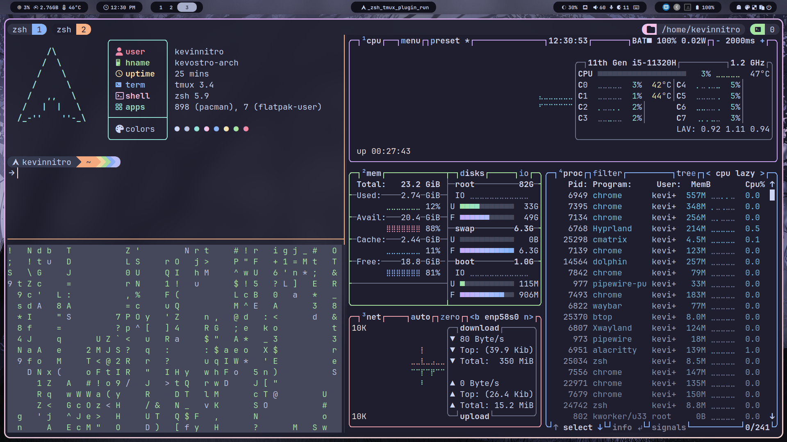
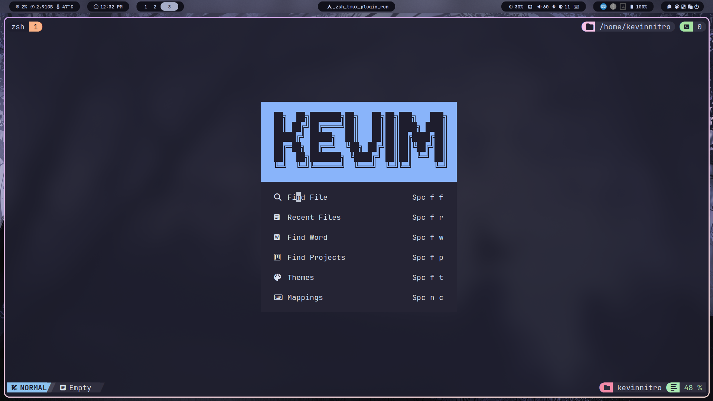
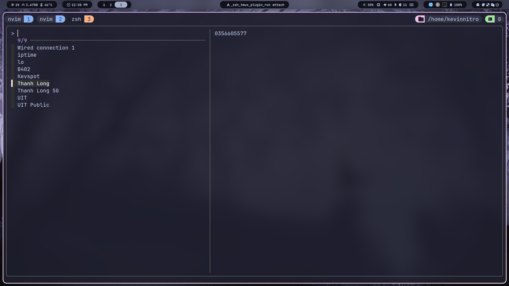
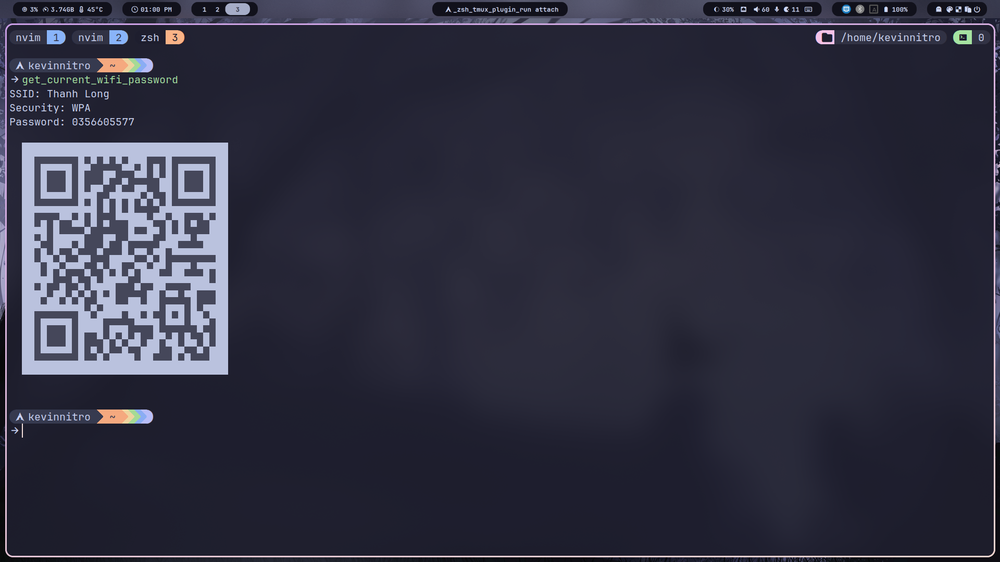

# KEVINNITRO DOTFILES

My Windows and Arch linux (hyprdots) managed by chezmoi

> [!NOTE]
> Haven't enough money to buy Mac yet

---

## 😎 SHOWCASE

### Terminal

| **Linux**                                             | **Windows**                                               |
| ----------------------------------------------------- | --------------------------------------------------------- |
|  |  |

### Neovim

> [!NOTE]
> Neovim config <https://github.com/KevinNitroG/nvim>

| **Linux**                                         | **Windows**                                           |
| ------------------------------------------------- | ----------------------------------------------------- |
|  |  |

### Find files / directories / file content

> [!NOTE]
> Both pwsh and zsh have been configured

| **Files**                                            | **Directories**                                             |
| ---------------------------------------------------- | ----------------------------------------------------------- |
|  |  |

| **Ripgrep**                                                    | **Fzf**                                                        |
| -------------------------------------------------------------- | -------------------------------------------------------------- |
|  |  |

### Get wifi password

#### Zsh

| `get_wifi_password`                                               | `get_current_wifi_password`                                                       |
| ----------------------------------------------------------------- | --------------------------------------------------------------------------------- |
|  |  |

#### Pwsh

|                                 **SELECT**                                  |                                  **SHOWN**                                  |
| :-------------------------------------------------------------------------: | :-------------------------------------------------------------------------: |
|  |  |

---

## 📝 INSTALLATION

- Install chezmoi: <https://www.chezmoi.io/install>
- Config SSH key and GPG key: Read in docs below

- [Windows](./docs/windows.md)
- [Linux](./docs/linux.md)

---

## 💁 REFERENCES

### Wallpaper

- <https://github.com/D3Ext/aesthetic-wallpapers>
- <https://github.com/DenverCoder1/minimalistic-wallpaper-collection>
- <https://github.com/Gingeh/wallpapers>

### Other dotfiles

#### Preconfig

- <https://github.com/JaKooLit/Hyprland-Dots>
- <https://github.com/end-4/dots-hyprland>
- <https://github.com/gh0stzk/dotfiles> (BSPWM)
- <https://github.com/koeqaife/hyprland-material-you>
- <https://github.com/prasanthrangan/hyprdots>
- <https://gitlab.com/stephan-raabe/dotfiles>

#### Others

- <https://github.com/2KAbhishek/dots2k>
- <https://github.com/2nthony/dotfiles> (Lazygit?)
- <https://github.com/Alexis12119/dotfiles>
- <https://github.com/Cybersnake223/Hypr>
- <https://github.com/Integralist/dotfiles>
- <https://github.com/JoosepAlviste/dotfiles>
- <https://github.com/asilvadesigns/config>
- <https://github.com/bahamas10/dotfiles> (YSAP)
- <https://github.com/chaneyzorn/dotfiles>
- <https://github.com/craftzdog/dotfiles-public>
- <https://github.com/dlvhdr/dotfiles>
- <https://github.com/dreamsofautonomy/zensh>
- <https://github.com/linkarzu/dotfiles-latest>
- <https://github.com/mischavandenburg/dotfiles>
- <https://github.com/nguyenvukhang/docker-dev>
- <https://github.com/nguyenvukhang/dots> (git config!)
- <https://github.com/omerxx/dotfiles> (have good tmux plugins)
- <https://github.com/p3nguin-kun/dotfiles>
- <https://github.com/petobens/dotfiles> (X config, tmux for linux & mac)
- <https://github.com/rusty-electron/dotfiles>
- <https://github.com/siduck/dotfiles>
- <https://github.com/stevearc/dotfiles>
- <https://github.com/wincent/wincent> (Old dotfiles 😱)

### Chezmoi

- <https://github.com/megabyte-labs/install.doctor>
