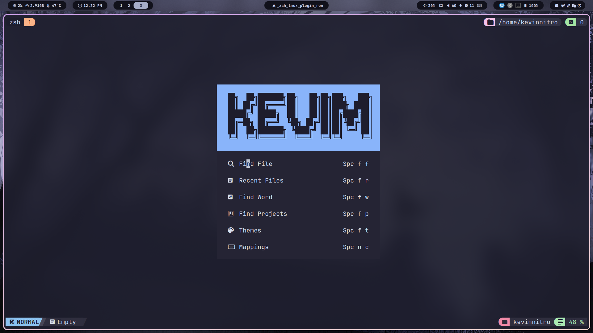
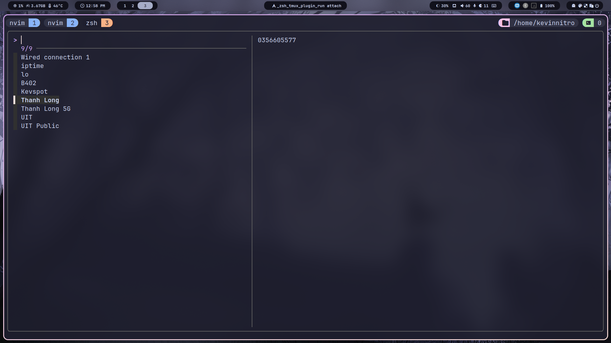

# KEVINNITRO LINUX DOTFILES

---

<!-- START doctoc generated TOC please keep comment here to allow auto update -->
<!-- DON'T EDIT THIS SECTION, INSTEAD RE-RUN doctoc TO UPDATE -->

- [😎 PREVIEW](#-preview)
  - [Terminal](#terminal)
  - [Neovim](#neovim)
  - [Get wifi password](#get-wifi-password)
- [🪴 INSTALL](#-install)
  - [1️⃣ Add Keys](#-add-keys)
  - [2️⃣ Install](#-install)
  - [3️⃣ ITODO](#-itodo)
    - [Browser](#browser)
      - [Brave](#brave)
- [UTILS](#utils)
  - [Arch installation](#arch-installation)
  - [Rclone mount](#rclone-mount)
  - [Systemctl](#systemctl)
  - [XDG](#xdg)
  - [Fingerprint](#fingerprint)
  - [Tmux](#tmux)
  - [Wallpaper](#wallpaper)
  - [Other dotfiles](#other-dotfiles)
    - [Preconfig](#preconfig)
    - [Others](#others)

<!-- END doctoc generated TOC please keep comment here to allow auto update -->

---

## 😎 PREVIEW

### Terminal


### Neovim



> [!NOTE]
>
> I use [Alexis12119's nvim config](https://github.com/Alexis12119/nvim-config)
>
> My [fork config](https://github.com/KevinNitroG/Alexis12119-nvim)

### Get wifi password

| `get_wifi_password`                                                | `get_current_wifi_password`                                                        |
| ------------------------------------------------------------------ | ---------------------------------------------------------------------------------- |
|  |  |

---

## 🪴 INSTALL

### 1️⃣ Add Keys

- SSH
  ```sh
  eval "$(ssh-agent -s)"
  chmod 700 ~/.ssh/
  chmod 644 ~/.ssh/id_ed25519.pub
  chmod 600 ~/.ssh/id_ed25519
  ```
  > Also make sure to start ssh agent every time login!
- GPG
  ```sh
  gpg --import public.gpg
  gpg --import secret.gpg
  gpg --edit-key KevinNitroG
  trust
  5
  y
  quit
  ```

> [!NOTE]
>
> In order to encrypt / decrypt chezmoi

### 2️⃣ Install

```bash
bash <(curl -fsSL https://raw.githubusercontent.com/KevinNitroG/linux-dotfiles/main/install/install.sh)
```

### 3️⃣ ITODO

#### Browser

- Memory Saver
  ```
  www.youtube.com
  www.messenger.com
  ```

##### Brave

- Shield
  - Custom lists
    ```
    https://abpvn.com/vip/kev.txt?ublock
    https://cdn.jsdelivr.net/gh/hagezi/dns-blocklists@latest/adblock/pro.txt
    https://raw.githubusercontent.com/bogachenko/fuckfuckadblock/master/fuckfuckadblock.txt?_=rawlist
    https://raw.githubusercontent.com/bogachenko/fuckfuckadblock/master/fuckfuckadblock-mining.txt?_=rawlist
    ```
  - Custom filters: [custom filter](./dot_config/browser-data/adblock/custom_filters.txt)

---

## UTILS

### Arch installation

```sh
setfont ter-132n
```

### Rclone mount

> [!NOTE]
>
> Guide: https://github.com/rclone/rclone/wiki/Systemd-rclone-mount

- Create dir
  ```sh
  mkdir ~/<remote-name>
  ```
- Start service
  ```sh
  systemctl --user start rclone@<remote-name>
  ```
- Enable service _(auto start to mount)_
  ```sh
  systemctl --user enable rclone@<remote-name>
  ```

### Systemctl

- Clean services
  ```sh
  systemctl reset-failed
  ```

### XDG

- Set default application
  > Example for Brave
  ```sh
  xdg-settings set default-web-browser brave-browser.desktop
  xdg-mime default brave-browser.desktop x-scheme-handler/http
  xdg-mime default brave-browser.desktop x-scheme-handler/https
  xdg-mime default brave-browser.desktop x-scheme-handler/mailto
  ```

### Fingerprint

> [!NOTE]
>
> - Doc from ARCH: https://wiki.archlinux.org/title/fprint
> - Supported devices: https://fprint.freedesktop.org/supported-devices.html
> - My device _(Dell Vostro 14 5410)_: `27c6:639c	Goodix MOC Fingerprint Sensor`

### Tmux

- attach starting directory to current session ([Source](https://stackoverflow.com/a/54444853/23173098))
  ```tmux
  attach-session -t . -c /path/to/new/directory
  ```

### Wallpaper

- https://github.com/D3Ext/aesthetic-wallpapers
- https://github.com/DenverCoder1/minimalistic-wallpaper-collection
- https://github.com/Gingeh/wallpapers

### Other dotfiles

#### Preconfig

- https://github.com/JaKooLit/Hyprland-Dots
- https://github.com/end-4/dots-hyprland
- https://github.com/gh0stzk/dotfiles (BSPWM)
- https://github.com/koeqaife/hyprland-material-you
- https://github.com/prasanthrangan/hyprdots
- https://gitlab.com/stephan-raabe/dotfiles

#### Others

- https://github.com/2KAbhishek/dots2k
- https://github.com/2nthony/dotfiles (Lazygit?)
- https://github.com/Alexis12119/dotfiles
- https://github.com/Cybersnake223/Hypr
- https://github.com/Integralist/dotfiles
- https://github.com/JoosepAlviste/dotfiles
- https://github.com/asilvadesigns/config
- https://github.com/bahamas10/dotfiles (YSAP)
- https://github.com/chaneyzorn/dotfiles
- https://github.com/craftzdog/dotfiles-public
- https://github.com/dlvhdr/dotfiles
- https://github.com/dreamsofautonomy/zensh
- https://github.com/linkarzu/dotfiles-latest
- https://github.com/mischavandenburg/dotfiles
- https://github.com/nguyenvukhang/docker-dev
- https://github.com/nguyenvukhang/dots (git config!)
- https://github.com/omerxx/dotfiles (have good tmux plugins)
- https://github.com/p3nguin-kun/dotfiles
- https://github.com/petobens/dotfiles (X config, tmux for linux & mac)
- https://github.com/rusty-electron/dotfiles
- https://github.com/siduck/dotfiles
- https://github.com/stevearc/dotfiles
- https://github.com/wincent/wincent (Old dotfiles 😱)
